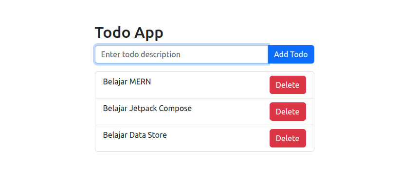

# Hasil

# Penggunaan

1.  Clone Projek
2.  Buka Projek di VScode
3.  Masuk ke path backend dengan **cd backend** dan lakukan **npm i** serta jalankan projek dengan **node server.js**
4.  Masuk juga di path frontend dengan **cd frontend** dan lakukan **npm i** serta jalankan projek dengan **npm start**
5.  Akses http://localhost:3000 di browser.

> Catatan: Pastikan kalian sudah memiliki NodeJS dan MongoDB
